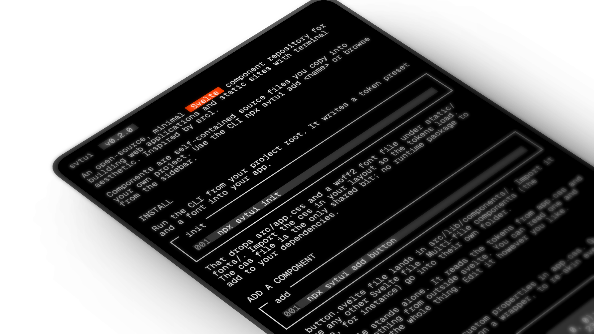

# svtui



Terminal-styled Svelte 5 components. Each one is a single self-contained
`.svelte` file you copy into your own project. No runtime deps, monospace-first.
The look borrows from [srcl](https://sacred.computer).

## Use it

svtui is a CLI in the shadcn/ui style. You add components straight into your
own repo:

```sh
npx svtui init            # writes the token preset (src/app.css) + a font
npx svtui list            # lists available components
npx svtui add button      # copies a component into src/lib/components
npx svtui add table       # multi-file components land in their own subfolder
```

Run `init` first. The components read the CSS variables it defines.

If a component ever needs an npm dependency, `add` prints the install command
for whichever package manager it finds in your project. None of the current
components do.

### Flags

```
--cwd <dir>   run in <dir> instead of the current directory
--out <dir>   write components to <dir> instead of <cwd>/src/lib/components
--force       overwrite existing files
```

## Components

Button, ActionButton, ActionList, Badge, Card, CodeBlock, Input, Label,
Checkbox, Divider, Row, RowSpaceBetween, Indent, Block, Text, Table, Avatar,
Tooltip, AlertBanner, Breadcrumbs, BarLoader, BarProgress, BlockLoader,
MatrixLoader, Accordion, Navigation, RadioButton, RadioButtonGroup, TextArea,
AsciiCanvas.

Thirty components today. `svtui list` shows the current set.

## Theming

Components read CSS custom properties from `src/app.css`, which `svtui init`
writes. Override the variables to retheme. The preset holds a light ramp and a
dark ramp, plus optional OKLCH color tints. The docs site toggles light and
dark client-side; the variables are the same shape either way, so copy
whichever you need.

## This repo

- `src/lib/components`: canonical component source, and the docs site's source of truth.
- `src/routes`: the docs site (SvelteKit, prerendered to static HTML).
- `registry.json`: component manifest, names to files and npm deps.
- `scripts/flatten.ts`: builds `cli/registry/` from `src/lib/components` for the CLI to ship.
- `cli/`: the `svtui` npm package, which is the CLI itself.

## License

Unlicense (public domain). See [LICENSE](./LICENSE).
